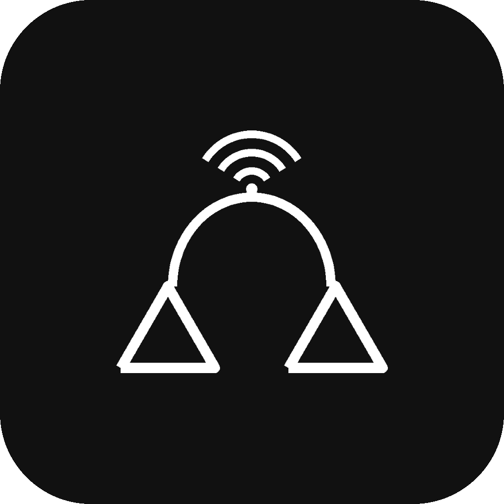

<div align="center">



# Mac Connect

**Make your Android phone work with your Mac the way an iPhone does.**

Mirror and control the phone, take calls, read and send texts, move files, browse your
gallery, share the clipboard, and control the Mac from the phone. Everything travels over
your own Wi-Fi. No cloud, no accounts, no tracking.

[](LICENSE)


[](https://claude.com/claude-code)

[Features](#features) · [How it works](#how-it-works) · [Install](#install) ·
[Build from source](docs/BUILDING.md) · [Architecture](docs/ARCHITECTURE.md) · [Protocol](docs/PROTOCOL.md)

</div>

---

## What is this?

Mac Connect is two apps that talk directly to each other on your local network:

- **Mac app:** a menu-bar and window app in Swift and SwiftUI, for macOS 13 and later.
- **Android app:** a companion app in Kotlin, for Android 8.0 (API 26) and later.

They find each other with mDNS (Bonjour), pair once with a QR code, and then exchange
everything over a single TCP connection using Protocol Buffers. Your messages, calls, files,
screen and clipboard never leave your network, because there is no server in the middle.

Apple's Continuity and Microsoft's Phone Link were the inspiration. This one is open, free,
and runs entirely on hardware you own. It is vibe coded with Claude: I decided what it should
do and tested it on a real Mac and phone every day, and Claude wrote the Swift and Kotlin.

## Features

### Screen mirroring and control
- Live H.264 mirror of the phone screen on the Mac.
- Control it with your **mouse and keyboard**: click to tap, click-drag to swipe, two-finger
  scroll, and type into text fields.
- A right-click menu for **Back, Home, Recents and Notifications**, directional swipes,
  **Wake Screen** and **Lock Phone**.
- Type your **lock-screen or app-lock PIN** from the Mac keyboard.
- The phone screen stays awake while you use it, with its backlight near minimum, and closing
  the mirror stops capture. You watch on the Mac, so the phone's display never burns in.
- Opening the mirror on the Mac asks for **Touch ID**.

### Calls
- A phone view on the Mac with **Contacts, Recents (your real call history) and a Dial Pad**.
- Type numbers straight from the Mac keyboard.
- An **incoming-call pop-up** on the Mac with Answer and Decline, and a ringtone.
- Place calls from the Mac, mute, and hang up.

### Find My Phone
- A **Find Phone** tile in the menu bar makes the phone ring at full volume, even on silent,
  with a full-screen Stop button over the lock screen. It stops by itself after a minute.

### Messages
- Read and reply to **SMS** from the Mac in real time, with contact names.

### Files
- Browse the phone's storage like Finder, with **Quick Look previews** (Space), image and
  video thumbnails, and **New Folder, Rename and Delete**.
- **Drag files in and out** between Finder and the phone, or use ⌘C and ⌘V.
- **Send files both ways, AirDrop style.** Drop files on the Mac's send window and they land in
  the phone's Downloads. Share from any Android app to *Mac Connect* and they land in the Mac's
  Downloads and open in Finder.

### Gallery
- The phone's **photos and videos** on the Mac, in folders (All Media, Videos, Camera,
  Screenshots, WhatsApp and more).

### Notifications
- Phone notifications appear on the Mac with the **real app name and icon**, and respect
  macOS **Focus and Do Not Disturb**.
- An on/off switch in the menu bar, and one sound per app every 30 seconds, so a busy group
  chat does not ding nonstop.

### Clipboard
- **Copy on one device, paste on the other**, including **images**, both ways.

### Media
- Control **phone playback** from the Mac, and **Mac playback** (Music, Spotify, or anything
  that listens to media keys, such as YouTube in a browser) from the phone.

### Control the Mac from the phone
- Volume, **brightness**, Wi-Fi, **Bluetooth**, lock, sleep, and a find-my-Mac sound.
- Live **Mac battery** on the phone and live **phone battery** on the Mac.

### Always connected
- Pair once. After that the two reconnect on their own whenever they are on the same
  Wi-Fi, like AirPods, without scanning the QR code again. The Mac searches hard for a couple
  of minutes, then retries now and then to save battery, and reconnects the moment it wakes.
- **Bluetooth fallback.** When Wi-Fi cannot carry the link, notifications, calls and SMS keep
  flowing over Bluetooth LE, and it switches back to Wi-Fi on its own.
- **Disconnect means disconnect.** Press it and the Mac stops looking until you press Connect.

## How it works

```
┌──────────────┐        mDNS discovery (_androidbridge._tcp)        ┌──────────────┐
│   Mac app    │  ◀───────────────────────────────────────────────▶ │ Android app  │
│  (SwiftUI)   │                                                     │   (Kotlin)   │
│              │        TCP + Protocol Buffers (one socket)          │              │
│  features ◀──┼────────────  envelope.oneof routing  ──────────────┼──▶ bridges   │
└──────────────┘                                                     └──────────────┘
        ▲                                                                    ▲
        └──────── QR pairing (one time): keys exchanged over TCP ───────────┘
```

- **Pairing.** The Mac shows a QR code with its IP addresses and a port (47291). The phone
  scans it, connects, and the two exchange device IDs and public-key fingerprints over TCP.
- **Discovery and reconnect.** The phone advertises itself over mDNS and the Mac browses for
  it. If mDNS is quiet, the Mac dials the phone's last known IP directly.
- **Transport.** Every message is a protobuf `Envelope` with a `oneof payload`, sent
  length-prefixed over one TCP connection. The schema lives in
  [`Shared/proto/messages.proto`](Shared/proto/messages.proto) and is described in
  [docs/PROTOCOL.md](docs/PROTOCOL.md).

The full breakdown is in [docs/ARCHITECTURE.md](docs/ARCHITECTURE.md), and every feature
with its caveats is in [docs/FEATURES.md](docs/FEATURES.md).

### Privacy

Everything is peer-to-peer on your LAN. There is **no backend, no account and no telemetry**.
The only data that crosses the wire is what you ask for (a notification, a file you open, the
screen while you mirror it), and it goes straight to your other device.

## Install

Build both apps from source with [docs/BUILDING.md](docs/BUILDING.md). With Xcode and
Android Studio already installed it takes about ten minutes. Signed downloads will be
published on the [Releases](https://github.com/hussaintrawadi/mac-connect/releases) page.

1. **Mac.** Open the built app (or the DMG from `scripts/build_dmg.sh`) and move
   **Mac Connect** to Applications. On first launch, allow Local Network, Camera, Microphone
   and, if you want them, Notifications.
2. **Android.** Install the APK. During onboarding, grant Messages, Contacts, Phone, Photos
   and Media, Notification access, Accessibility, and "Display over other apps". The in-app
   privacy screen explains what each one is for.
3. **Pair.** Open Mac Connect on the Mac, which shows a QR code. On the phone tap
   *Pair with Mac* and scan it. Both devices must be on the same Wi-Fi network.

> **About sideloading.** The Android app uses sensitive permissions (SMS, call log,
> accessibility) and is installed outside the Play Store, so Google Play Protect may warn
> about it. That is expected for a self-hosted tool like this.

## Limitations

What is not possible, and why:

- **Call audio through the Mac's mic and speakers.** Android and macOS block this for
  non-system apps. You can control calls, not carry their audio.
- **Unlocking the phone with Touch ID from the Mac.** Android has no API for it. You can wake
  the screen and type your PIN from the Mac keyboard instead.
- **Seeing the secure lock screen.** Android blocks capture of secure surfaces, so the lock
  screen shows black in the mirror. Typing the PIN still works.
- **Encryption on the wire.** The connection is plain TCP on your LAN, with no TLS yet. It is
  meant for a trusted home or office network.
- **Bluetooth carries the essentials only.** Notifications, calls and SMS work over the
  Bluetooth fallback. Mirroring, files and the gallery need Wi-Fi.

## Project layout

```
MacApp/            SwiftUI Mac app (XcodeGen project in project.yml)
AndroidApp/        Kotlin Android app (Gradle)
Shared/proto/      messages.proto, the single source of truth for the protocol
docs/              architecture, protocol, features, build guide
scripts/           build_dmg.sh, build_apk.sh, app icon generator
```

## Documentation

| Doc | What is in it |
|-----|---------------|
| [docs/FEATURES.md](docs/FEATURES.md) | Every feature, how it works, and its caveats |
| [docs/ARCHITECTURE.md](docs/ARCHITECTURE.md) | Project layout, connection model, components |
| [docs/PROTOCOL.md](docs/PROTOCOL.md) | The wire protocol and message catalogue |
| [docs/BUILDING.md](docs/BUILDING.md) | Build, sign and package both apps |
| [CONTRIBUTING.md](CONTRIBUTING.md) | How to contribute |
| [SECURITY.md](SECURITY.md) | Reporting security problems |

## Contributing

Contributions are welcome. Start with [CONTRIBUTING.md](CONTRIBUTING.md). The ground rules
are simple: nothing leaves the local network, and every protocol change is implemented on
both sides.

## License

[MIT](LICENSE). Free to use, change and share. Built by
[Hussain Trawadi](https://github.com/hussaintrawadi), vibe coded with [Claude](https://claude.com/claude-code).
